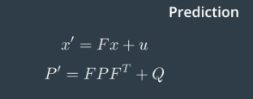

# Self-Driving Car Engineer Nanodegree Extended Kalman Filter Project

## Project Overview
The goal of this project is to implement the Extended Kalman Filter (EKF) in C++, and use the Kalman Filter with given lidar and radar measurements to track a moving object of interest that travels around the vehicle. To pass the project, calculated RMSE values should be less than or equal to the tolerance provided in the project rubric.

## Source Code Structure
The source code files can be found in the src folder at root level of the Git repository. 
* main.cpp/.h is the entry point of the executable, which communicates with the Term 2 Simulator to obtain inputs via uWebSocketIO, pass the inputs to FusionEKF for making prediction and state update, calculate RMSE values, then pass the calculated outputs back to the simulator.
* FusionEKF.cpp/.h implements the measurement processing logic, including initialization of kalman filter state and covariance matrices, and invoke Predict and Update/UpdateEKF methods based on sensor type using the instance of KalmanFilter
* kalman\_filter.cpp/.h implements the low-level details of prediction calculation and state updates. The mathematical formulas can be found in the [reference](https://s3.amazonaws.com/video.udacity-data.com/topher/2018/June/5b327c11_sensor-fusion-ekf-reference/sensor-fusion-ekf-reference.pdf) provided by the course.
* tools.cpp/.h provides the method for calculating RMSE values
* measurement_package.h defines the data structure representing sensor measurement provided by the simulator

## Project Dependencies

* [Udacity Term 2 Simulator](https://github.com/udacity/self-driving-car-sim/releases) v1.45
* [uWebSocketIO](https://github.com/uWebSockets/uWebSockets) The setup instructions can be found [here](https://classroom.udacity.com/nanodegrees/nd013/parts/edf28735-efc1-4b99-8fbb-ba9c432239c8/modules/49d8fda9-69c7-4f10-aa18-dc3a2d790cbe/lessons/3feb3671-6252-4c25-adf0-e963af4d9d4a/concepts/7dedf53a-324a-4998-aaf4-e30a3f2cef1d).
* cmake >= 3.5
  * [Installation instructions](https://cmake.org/install/)
* make >= 4.1 (Linux, Mac), 3.81 (Windows)
  * Linux: make is installed by default on most Linux distros
  * Mac: [install Xcode command line tools to get make](https://developer.apple.com/xcode/features/)
  * Windows: [Click here for installation instructions](http://gnuwin32.sourceforge.net/packages/make.htm)
* gcc/g++ >= 5.4
  * Linux: gcc / g++ is installed by default on most Linux distros
  * Mac: same deal as make - [install Xcode command line tools](https://developer.apple.com/xcode/features/)
  * Windows: recommend using [MinGW](http://www.mingw.org/) 

## Compilation and Execution Instructions

1. Clone this repo.
2. Make a build directory: `mkdir build && cd build`
3. Compile: `cmake .. && make` 
   * On windows, you may need to run: `cmake .. -G "Unix Makefiles" && make`
4. Launch Simulator, and select "EKF and UKF"
5. Run the compiled program: `./ExtendedKF `

## Measurement Processing Workflow

An illustration of the data flow for sensor measurement processing is shown below. All sensor measurements are packaged by main.cpp, and passed to FusionEKF::ProcessMeasurement() method, which implemented the workflow:

### Input Data ###
For each sensor measurement, the following attributes are provided:

*Laser*

| type | px | py | timestamp | actual x | actual y | actual vx | actual vy | yaw  | yawrate |
|:---|---|---|---|---|---|---|---|---|---:|
|L	|1.173848 | 0.4810729 | 1477010443100000 | 1.119984 | 0.6002246 | 5.199429 | 0.005389957 | 	0.001036644	| 0.02072960 |

*Radar*

| type | rho | phi | rho dot | timestamp | actual x | actual y | actual vx | actual vy | yaw  | yawrate |
|:---|---|---|---|---|---|---|---|---|---|---:|
|R	|1.047505 |0.3892401 | 4.511325 |1477010443100000 | 1.379955 | 0.6006288 | 5.198979 | 0.01077814 | 	0.002073124	| 0.02763437 |

###Predition###
The difference in timestamps between two consecutive measurements, delta_t is used to update transition matrix F and process noise covariance matrix Q. With updated F and Q, state prediction can be obtained by using the formula below:

###Update###
For laser measurement, the raw measurement in each measurement package contains position coordinates px and py, and is passed to method KalmanFilter::Update(). For radar measurement, it is represented in polar coordinates of range, bearing, and range rate, and is passed to method KalmanFilter::UpdateEKF(). Both methods calculate the updated states using the formulas below, with different inputs y, H, and R:

.

In measurement update for laser sensor, the 4D predicted state vector is mapped to the 2D measurement space of lidar sensor, $y = z - Hx'$. 

In measurement update for radar sensor, the prediction error y is calculated by mapping predicted state vector from cartesian to polar coordinates, then subtract the result from radar measurement: y = z - h(x'), where 

Moreover, the H matrix for radar measurement update is the Jacobian matrix, as first order Taylor expansion is used to approximate the nonlinear function h(x).

After the ProcessMeasurement method returns, the estimated values and actual values of position and velocity are used to calculate RMSE values as measurement of the Kalman Filter performance. The estimated position and RMSE values are sent back to the simulater to be displayed.

## Results 

With both Laser and Radar sensor measurements included, the resulted plots and RMSE values for given datasets are as below:

Additionally, experimenting has been done by using only measurement of one sensor type, and the RMSE values indicated that the performance of Extended Kalman Filter were better when measurements from both sensor types were used. 

| Dataset  | Sensor(s) | `RMSE X`  | `RMSE Y`  | `RMSE VX`  | `RMSE VY` |
|----------|-----------|-----------|-----------|------------|-----------|
| `1`      | `L+R`     | `0.0973`  | `0.0855`  | `0.4513`   | `0.4399`  |
| `2`      | `L+R`     | `0.0726`  | `0.0967`  | `0.4579`   | `0.4966`  |
| `1`      | `L`       | `0.1222`  | `0.0984`  | `0.5825`   | `0.4567`  |
| `2`      | `L`       | `0.0959`  | `0.1005`  | `0.5422`   | `0.4649`  |
| `1`      | `R`       | `0.1918`  | `0.2798`  | `0.5575`   | `0.6567`  |
| `2`      | `R`       | `0.2244`  | `0.2954`  | `0.5870`   | `0.7338`  |

## Additional Resources
Matlab [scripts](https://github.com/udacity/CarND-Mercedes-SF-Utilities) are provided by the course for generating additional data.

